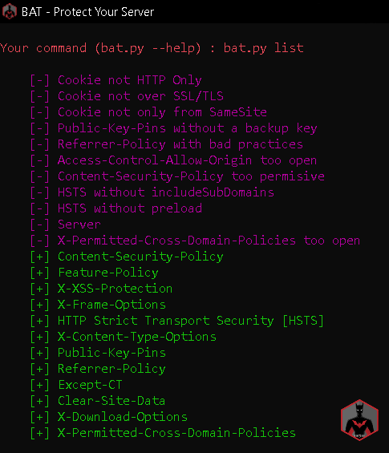
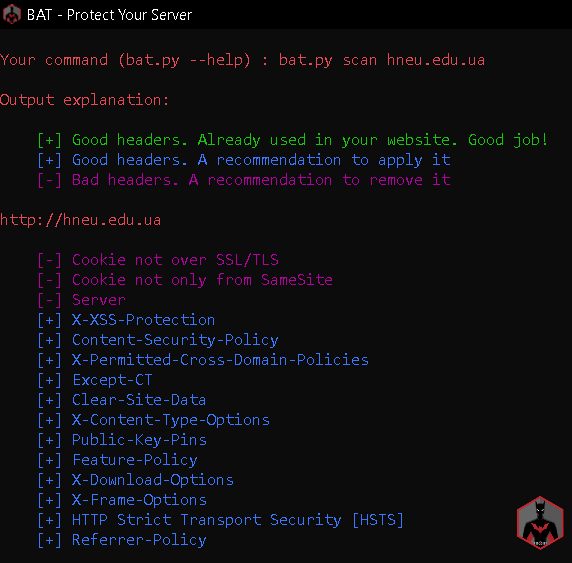

# ‏‏‎ ‎‏‏‎ ‎‏‏‎ ‎‏‏‎ ‎‏‏‎ ‎_________‏‏‎ ‎‏‏‎ ‎‏‏‎ ‎‏‏‎ ‎‏‏‎ ‎‎‎ BAT‏‏‎ ‎‏‏‎ ‎‏‏‎ ‎‏‏‎ ‎‏‏‎ ‎‏‏‎ ‎_________

‏‏‎ ‎‏‏‎ ‎‏‏‎ ‎‏‏‎ ‎‏‏‎ ‎‏‏‎ ‎‏‏‎ ‎‏‏‎ ‎‏‏‎ ‎‏‏‎ ‎‏‏‎ ‎______________________________________

## Description

**BAT** is a  tool to help everyone to securing their web-servers.

Until now **BAT** checks the website headers and recommends how to make it better.
## Dependences

* [Python 3.9](https://www.python.org/downloads/release/python-390)

## Usage

**BAT** has subcommands: *list* and *scan*.

~~~
$ ./bat.py -h
usage: bat.py [-h] {list,l,scan,s} ...

BAT - Protect Your Server

positional arguments:
  {list,l,scan,s}  sub-command help
    list (l)       show a list of available headers in bat catalog (that can
                   be used in scan subcommand -H option)
    scan (s)       scan url to hardening headers

optional arguments:
  -h, --help       show this help message and exit
~~~

### List Subcommand

The **list** subcommand lists all headers cataloged in **BAT** and can show informations about it as a description, links for more information and for how to's.

~~~
$ ./bat.py list -h
usage: bat.py list [-h] [-p PRINT [PRINT ...]] [-B]
                   [-a | -H HEADERS [HEADERS ...]]

optional arguments:
  -h, --help            show this help message and exit
  -p PRINT [PRINT ...], --print PRINT [PRINT ...]
                        a list of additional information about the headers to
                        print. For now there are two options: description and
                        refs (you can use either or both)
  -B, --no-banner       don't print the bat banner
  -a, --all             list all available headers [default]
  -H HEADERS [HEADERS ...], --headers HEADERS [HEADERS ...]
                        a list of headers to look for in the bat catalog
~~~

### Scan Subcommand

The **scan** subcommand perform a scan in a website looking for their headers.

~~~
$ ./bat.py scan -h
usage: bat.py scan [-h] [-v] [-a] [-g] [-b] [-H HEADERS [HEADERS ...]]
                   [-p PRINT [PRINT ...]]
                   [-i IGNORE_HEADERS [IGNORE_HEADERS ...]] [-B] [-E] [-n]
                   [-u USER_AGENT] [-r | -s]
                   url

positional arguments:
  url                   url to look for

optional arguments:
  -h, --help            show this help message and exit
  -v, --verbose         increase output verbosity: -v print response headers,
                        -vv print response and request headers
  -a, --all             scan all cataloged headers [default]
  -g, --good            scan good headers only
  -b, --bad             scan bad headers only
  -H HEADERS [HEADERS ...], --headers HEADERS [HEADERS ...]
                        scan only these headers (see available in list sub-
                        command)
  -p PRINT [PRINT ...], --print PRINT [PRINT ...]
                        a list of additional information about the headers to
                        print. For now there are two options: description and
                        refs (you can use either or both)
  -i IGNORE_HEADERS [IGNORE_HEADERS ...], --ignore-headers IGNORE_HEADERS [IGNORE_HEADERS ...]
                        a list of headers to ignore in the results
  -B, --no-banner       don't print the bat banner
  -E, --no-explanation  don't print the bat output explanation
  -o {normal,csv,json}, --output {normal,csv,json}
                        choose which output format to use (available: normal,
                        csv, json)
  -n, --no-redirect     don't follow http redirects
  -u USER_AGENT, --user-agent USER_AGENT
                        set user agent to scan request
  -k, --insecure        don't verify SSL certificate as valid
  -r, --recommendation  output only recommendations [default]
  -s, --status          output actual status (eg: existent headers only)
~~~

### Output

For now the output is only in normal mode. Understant it as follows:

* [+] Green Headers are good headers that is already used in your website. It's shown when use `-s` flag.
* [+] Blue Headers are good headers that is not applied on your website. We recommend apply them.
* [-] Magenta Headers are bad headers that open a breach on your website or maybe show a lots of information. We recommend fix it.

Example:

* Server header would be good to be removed
* Cookie over SSL/TLS would be good to be removed
* Cookie not only from SameSite would be good to be removed

### Screenshots

#### List BAT catalog

#### Scan from file

#### Scan url

#### Scan verbose

#### Headers information

## Contribute

For contribute guidelines look at [CONTRIBUTING](CONTRIBUTING.md)
